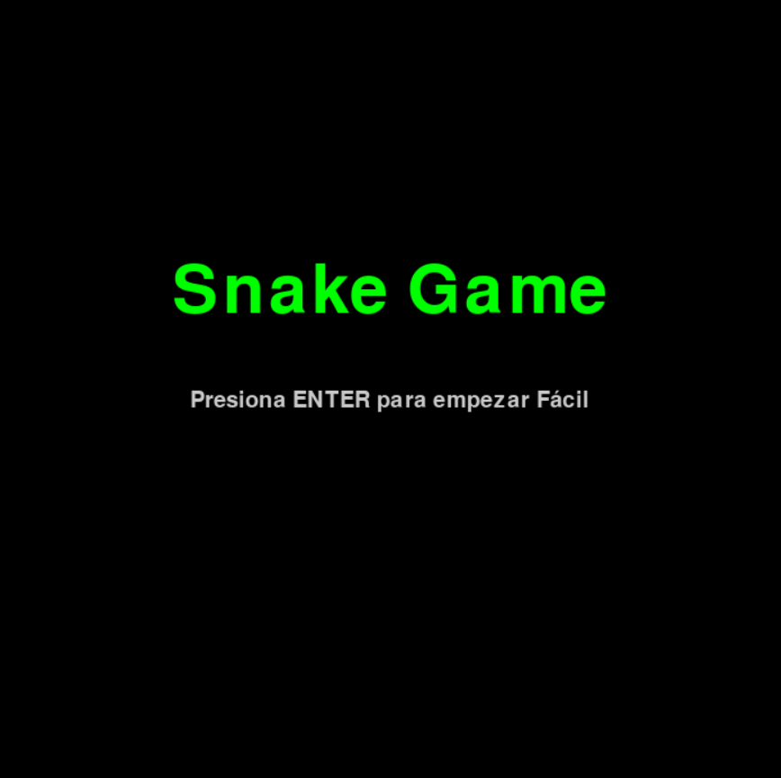
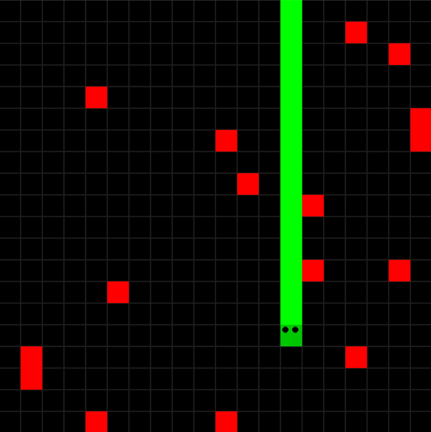
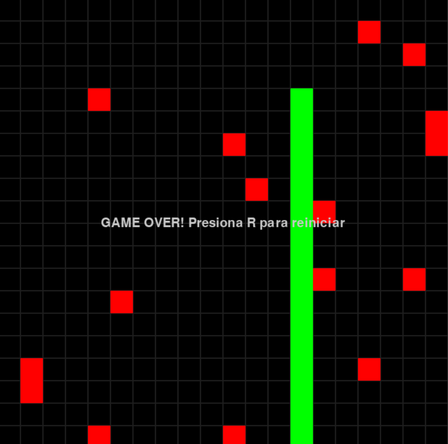

# Snake Game en Python

Esta es la primera versión del clásico juego Snake, desarrollada en Python utilizando Pygame. La versión inicial funciona como una maqueta jugable, con un solo nivel y un diseño simple, ideal para pruebas y aprendizaje.  

*Características de esta versión:*  

- Serpiente que va aumentando de tamaño al comer
- Comida que aparece en múltiples posiciones.
- Colisiones con bordes y consigo misma.
- Cuadrícula y pantalla de juego básicas.

---

## Capturas del juego

  
  
  
  


---

## Instalación

- **Requisito**: Python 3.10 o superior
1. Clonar el repositorio:
```bash
git clone https://github.com/alebarber7/snake-game.git
```

2. Instalar dependencias:
```bash
pip install pygame
```

3. Ejecutar el juego compilando:
```bash
python main.py
```

## Próximas mejoras
- Añadir menú de selección de dificultad.
- Guardado de puntuaciones y récords.
- Mejor diseño visual (sprites para la serpiente y manzanas).
- Modo de juego con obstáculos y niveles progresivos.
- Versión ejecutable (.exe) para Windows y binarios para Mac/Linux.
